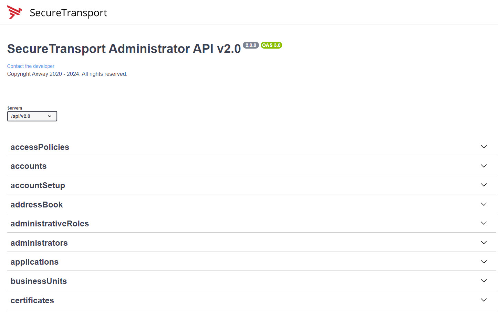

# SecureTransport-REST-API-Examples

## Table of Contents

1. [Introduction](#introduction)
2. [Common Terminologies](#common-terminologies)
3. [OpenAPI](#openapi)
4. [HTTP Methods](#methods)
5. [Structure](#structure)

## Introduction
SecureTransport 5.5, released in June 2020, introduced REST API 2.0. The prior API release is version 1.4. APIs were introduced to SecureTransport in 5.2.1 – though this document will not refer to those as that release (5.2.1) is no longer supported.
Currently supported APIs are V1.4 and V2.0 – both are available in ST release V5.5.

This github project looks at use cases from a specific viewpoint. Many clients and Axway themselves have implemented mechanisms to on-board clients and file transfer flows in an automated manner using APIs, rather than the alternative method of manual setups via the admin GUI of ST. Automation brings a reduced risk of introducing errors and also assists in adhering to any standards enforced by the owning institution in naming standards, security profiles etc.
Many other automation tasks such as certificate expiry monitoring, configuration drift from baseline, etc are all possible via API based scripts or programs.
 
The examples here are using linux curl command, the scripting language python and others. It should be pointed out that **ANY** language that supports HTTPS Restful APIs can be used. Please also note that the commands shown are not the sole method you might want to use. Feel free to simplify or extend further what is shown as a guideline and staring point.

## Common Terminologies

The following table shows a list of terms and acronyms used throughout this project.

| Definition | Description |
| ---------- | ----------- |
| API | Application Programming Interface |
| CRUDL | Create Read Update Delete List |
| HTTPS | Hypertext Transfer Protocol Secure |
| JSON | JavaScript Object Notation |
| MFT | Managed File Transfer |
| PGP | Pretty Good Privacy |
| ReST | Representational State Transfer |
| SaaS | Solution as a Service |
| SFTP | SSH File Transfer Protocol |
| ST | SecureTransport |
| TLS | Transport Layer Security |
| UI | User Interface |
| XML | eXtensible Markup Language |

## OpenAPI

SecureTransport provides an Open API (a.k.a. Swagger UI) which allows you to interactively explore its APIs.

In any browser enter as below, substituting your server’s IP and port used for the admin GUI. For example the default for a non root install would be: https://<<SERVER_IP>>:8444/api/v2.0/docs/index.html for version 2.0 or https://<<SERVER_IP>>:8444/api/v1.4/docs/index.html for version 1.4.

The above URLs all provide access to the ADMIN level APIS.  There is a smaller set of user level APIs available at the 8443 or 443 port.

You will be required to authenticate with an administrator username and password. Once authenticated, a screen as below will be seen.

Expanding any of the arrows will display the respective APIs along with available methods.

Selecting the GET /accounts for example will then open a window as below indicating all the possible parameters that might be used to select accounts from the system. Be careful of any API that is not a read or GET method.  PUTs, POSTs, DELETEs will all work if you enter the correct parameters and input data.

Note the ‘Try it out’ button. Select the button and you will now be able to use this API live.

The Open API provides a curl command equivalent that it is using to fetch the data. Notice also that a server response will be displayed showing the returned JSON data.

The HTTP success code of 200 is shown next to the response assuming all worked correctly. Finally, if you wish to download the response there is an option to download the output json to your PC.

By default, the system will only return up to (by default) 100 objects. This value can be changed via the Server Configuration Option Webservices.EntriesPerPage.

## ST API 2.0 Methods

When designing a RESTful API, it's crucial to use HTTP methods correctly to ensure clarity and consistency in your API's behavior. Here's a brief overview of the commonly used HTTP methods and their appropriate usage:

**GET**: Use GET to retrieve resource representations without modifying the server's state. It's safe and idempotent, meaning repeated requests should yield the same result.

**POST**: Employ POST to create new resources. The server assigns a unique identifier to the newly created resource. POST is not idempotent, as multiple identical requests may result in multiple resource creations.

**PUT**: Use PUT to update existing resources by replacing their entire content. It's idempotent, as repeated requests should have the same effect as a single request.

**PATCH**: Apply PATCH for partial updates to existing resources. It's more efficient than PUT when only a few fields need to be updated in a large resource.

**DELETE**: Utilize DELETE to remove resources from the server. It's idempotent, as the result remains the same whether you delete a resource once or multiple times. 
*Note*: The DELETE method is considered idempotent despite potentially returning different responses because idempotency in REST APIs focuses on the server-side effect rather than the client-side response.

**HEAD**: Similar to GET, but only retrieves headers without the response body. Use it to check resource metadata or determine the size of a potential GET response.

## Structure

### 01. Authentication

The first section covers an important entry point of the REST API - How to Authenticate?
Once you find the most appropriate one for you, feel free to adapt the examples.

### 02. Intro

- Myself
- Version

### 03. Connect to the system

- Daemons
- Servers

### Flow

- Applications
- Accounts
- Routes
- Route Steps Charsets
- Route Steps Metadata
- Sites
- Subscriptions
- Transfer Profiles

### File Transfers 

- Transfers
- Subscriptions

### Monitoring

- Events
- Logs
- Sessions
- Statistics Summary

### Business Units and Administration

- Administrative Roles
- Administrators
- Business Units

### Advanced User Management

- Account Setup
- Certificates
- Site Templates
- Address Book

### Maintenance

- Applications

### Configurations

- Configurations

### Others

- Access Policies
- Login Restriction Policies

- Cluster Services
- ICAP Servers
- LDAP Domains

- Mail Templates
- Transaction Manager
- User Classes
- Zones